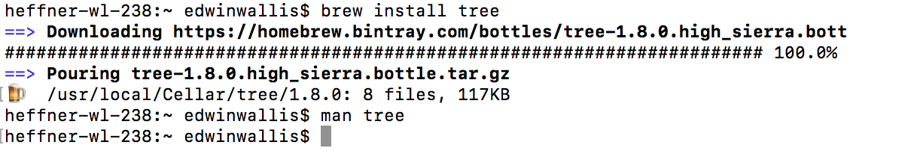
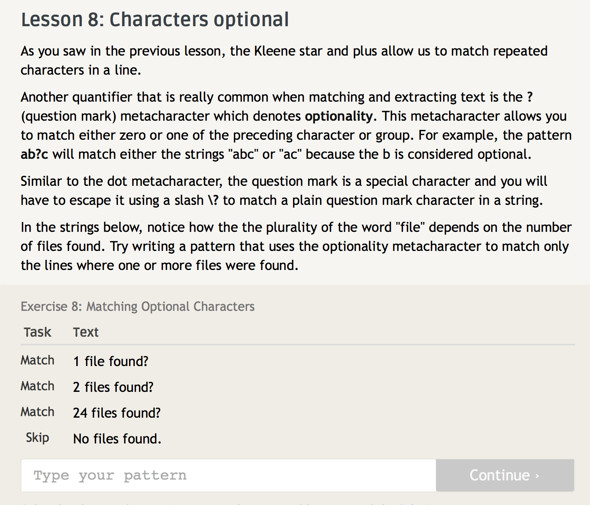
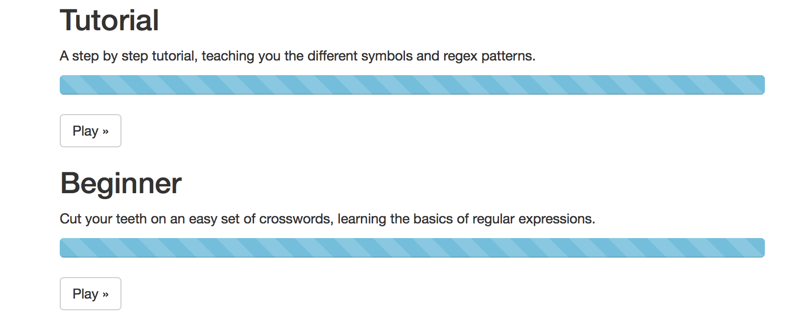
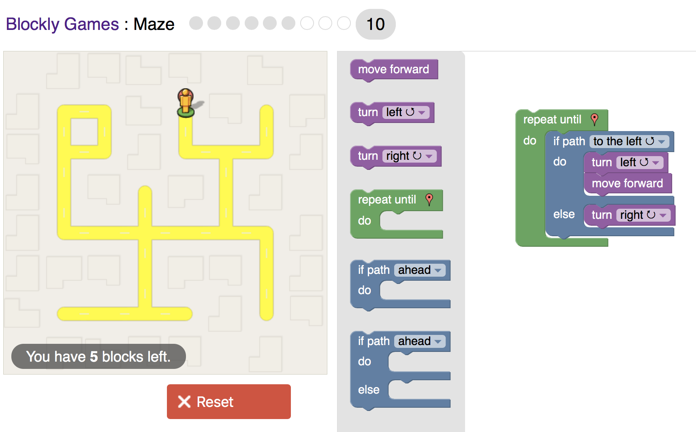

#Lab 1
###Smart Questions
1. Writing my thought process helped me get a response, what I was 
trying achieve and how 
2. I know it was mentioned in the article but it is a probably I have which
is being brief

###Free Culture
Reading the chapter I realized how easy it is to be victim to corporations
trying to protect themselves or make money. It is clear that steps must be taken ahead of time
to protect yourself. This student was one who wanted to just tinker and play with code,
which he should as a student. There are a few ways I can think of to 100% protect yourself.
Option one, keep everything absolutely private and dont make any money of it. There's no fun in that,
option two, make it Open Source. Once it is properly licensed you are free to tinker, play
and collaborate.  
###Linux Tree

###RegexOne

###RegexCrossword

###Blocky

###Reflection 
1. YACS is a very intresting Open Source Project because it is a student run project, and it is very successful and helps many students. It's so successful that its looking to be deployed in other schools.
2. One project I have always wanted to do for a hack-a-thon would be video game called Beir-run. Essentially it's a video game where a character collects drinks on a time limit but every time the player collects a drink the character's controls get a little harder, the images deteriorates and the music distorts. I thought it would be an intresting and fun project to create. 
3. One easy language for  this project would be processing. It's based off of java but is much easier to run visuals. One negative of this is that it is not a commonly used language so it would be harder for people to work on it. I would start with the movement aspects including increasingly randomizing and more difficult controls for the player. Then I would work on designing levels. Then move into designing images. Then move on to music and sound effects. Finally add final touches and anything else I would need for the project. 